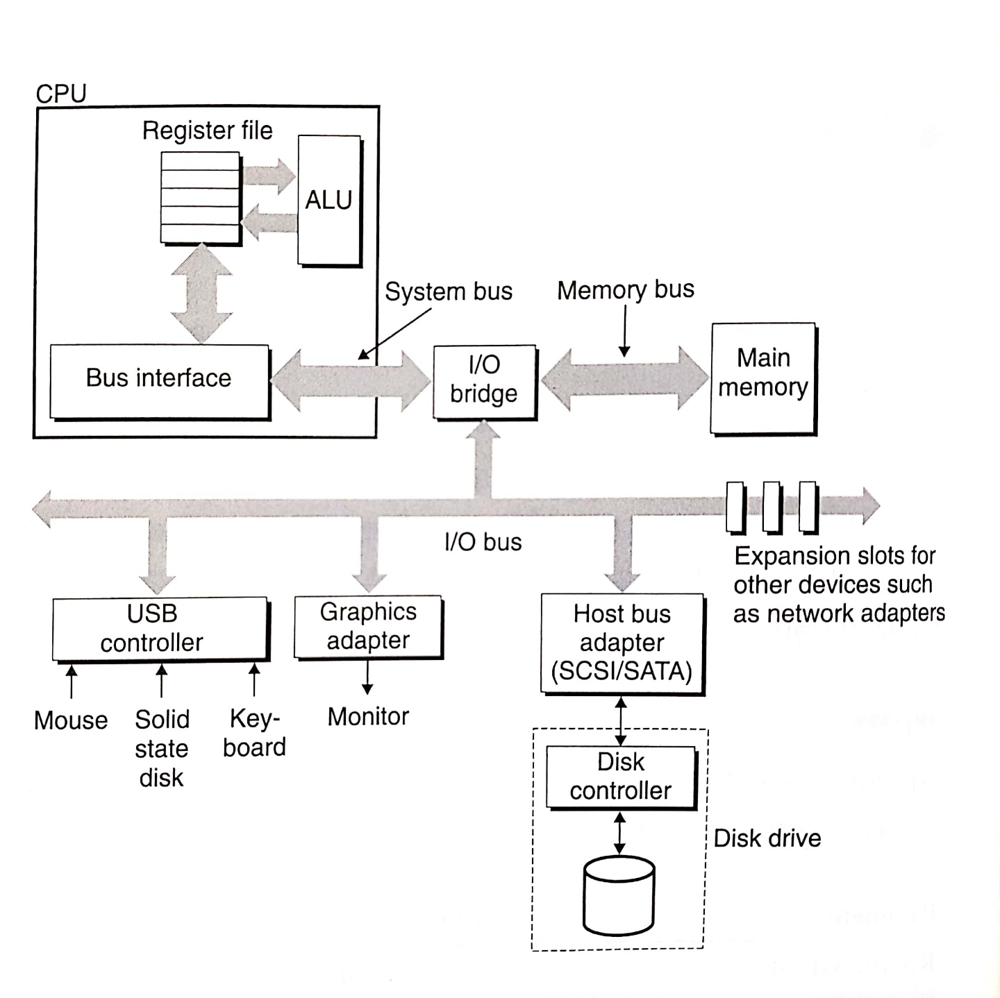
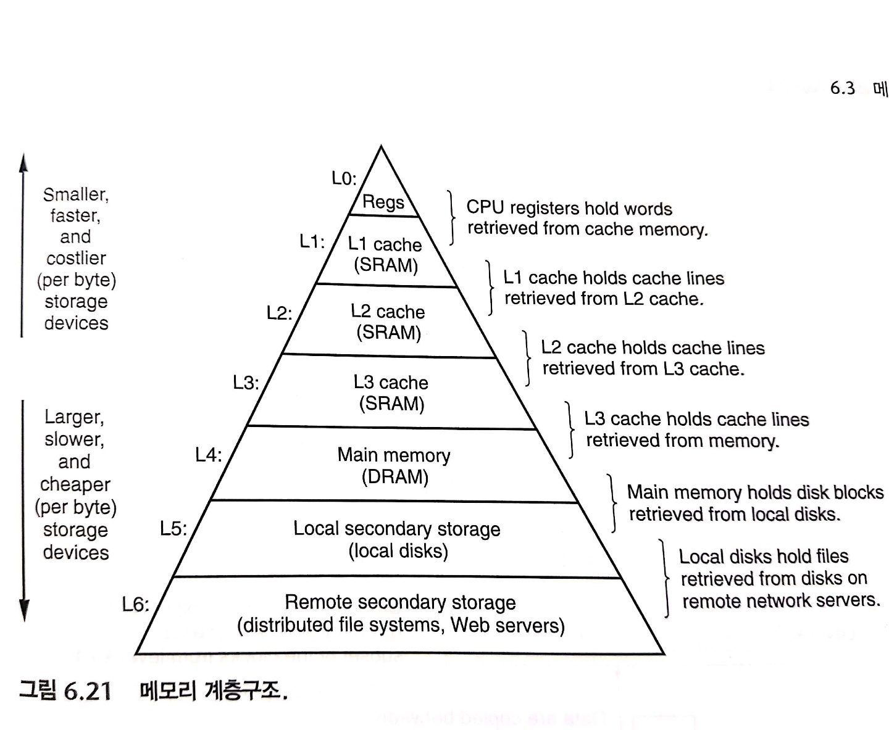
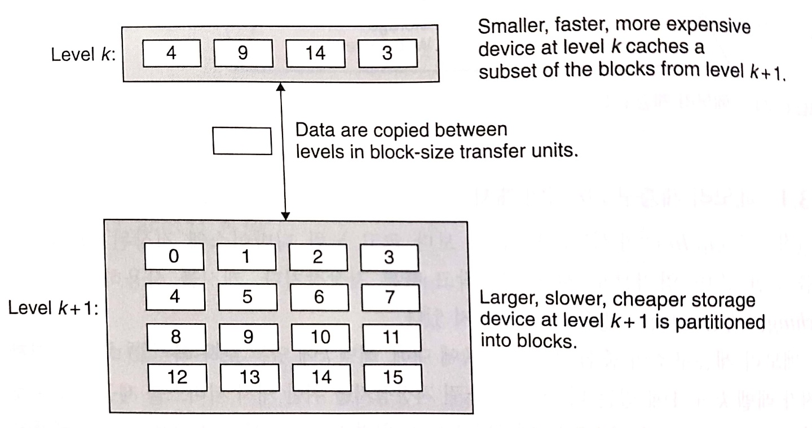

# 메모리와 캐시

### 지금까지

우리는 메모리를 볼 때, ‘수행할 명령어 및 데이터가 저장되고 CPU는 해당 데이터들에 선형 시간에 접근할 수 있다.’ 정도의 이해도와 함께 바라보았다.

### 실제로

저장 장치들은 각기 다른 용량, 비용, 접근 시간을 가지는 시스템들이 **계층 구조**를 이루고 있다. CPU에 가장 가까이 위치하는 레지스터부터, 캐시, 메인 메모리, 보조기억장치까지 점차 느린 접근 시간, 큰 용량을 가진다.

CPU가 레지스터에 저장되어 있는 프로그램의 명령어들을 0사이클로 접근할 수 있다고 가정하자. 하지만 만일 캐시에 저장되어 있다면 4~75사이클을, 메인 메모리에 저장되어 있다면 수백 사이클을, 디스크에 저장되어 있다면 수천만 사이클이 명령어들에 접근하는데 필요로 하게 된다.

메모리 계층 구조를 이해하고, 프로그램이 최대한 상위 계층의 메모리에 접근하도록 설계한다면 성능은 개선될 것이다. 이 개념은 **지역성**이라고 알려진 컴퓨터 프로그램의 근본 특징에 근거를 두고 있다. 좋은 지역성을 가지는 프로그램은 계속해서 동일한 집합, 혹은 근접한 집합의 데이터에 접근하려 하기 때문에 지역성이 나쁜 프로그램에 비해 상위 계층의 메모리에 접근하는 경향이 생기고 성능은 배로 좋을 것이다.

메모리에 대한 내용부터 살펴보자.

## 메모리와 메모리 읽고 쓰기

### RAM

RAM은 Random Access Memory의 줄임말이다. SRAM과 DRAM으로 구분되며, SRAM은 캐시에 사용되고 DRAM은 메인 메모리 등에 사용된다. DRAM에 비해 SRAM에 사용되는 트랜지스터의 수가 많기 때문에 비싸고 빠른 접근이 가능하다.

공통적으로 전원의 꺼지면 정보도 잃어버린다.

### ROM

ROM은 Read Only Memory의 줄임말이다. 과거와 달리 기술의 발전으로 데이터 읽기 뿐만 아니라 쓰기가 가능한 저장 장치들이 생겨났다.

전원이 꺼져도 정보를 잃지 않는다.

### Bus

신호가 오고가는 통로이다. 세부적으로 주소 버스(Address Bus), 데이터 버스(Data Bus), 제어 버스(Control Bus)로 분류할 수 있다.

### 버스 트랜잭션

버스는 장치 간에 데이터가 교환되기 위한 통로를 의미한다.

CPU와 메모리 간의 매 전송은 버스 트랜잭션이라고 부르는 일련의 단계를 거쳐 이루어진다. 읽기 트랜잭션은 메모리에서 CPU로, 쓰기 트랜잭션은 CPU에서 메모리로 데이터가 이동한다.

2개 이상의 장치들이 같은 버스를 공유할 수 있다. 따라서 어떤 트랜잭션이 수행되고 있는지 등의 정보를 제어 라인들을 통해 전송하여 트랜잭션들을 동기화한다. 예를 들면, 버스 상의 정보가 데이터인지 주소인지, 어디로 가는 데이터인지, 읽기인지 쓰기인지 등의 정보가 전송된다.

### 읽기 트랜잭션

그럼 한 번 읽기 트랜잭션과 쓰기 트랜잭션 과정을 살펴보자.



ⓒ Computer Systems A Programmer’s Perspective

1. CPU 통제 담당인 Control Unit에서 Bus Interface를 시작으로 읽기 트랜잭션을 개시한다.
2. 읽기를 원하는 메인 메모리의 주소를 시스템 버스에 보낸다.
3. I/O bridge는 신호를 메모리 버스에 따라 보낸다.
4. 메인 메모리는 메모리 버스에서 주소 신호를 감지하고, 해당 주소의 데이터를 읽어서 메모리 버스에 보낸다.
5. I/O bridge는 메모리 버스의 신호를 시스템 버스의 신호로 변환해서 시스템 버스에 보낸다.
6. CPU는 데이터를 감지해서 레지스터에 읽은 데이터를 복사한다.

위의 과정을 통해 유추해봤을 다른 장치들의 역할을 살펴보자.

### Bus Interface

CPU의 입장에서 데이터를 보내고, 받는 역할을 담당한다. 크게는 입출력 버스와, 실질적으로는 시스템 버스와 연결되어 있다.

### I/O Bridge

시스템 버스, 메모리 버스, 입출력 버스 사이의 매개체가 되어 들어온, 혹은 내보낼 신호를 알맞게 변환해주는 역할을 담당한다.

### 쓰기 트랜잭션

1. 시스템 버스에 데이터를 쓸 메인 메모리의 주소를 보낸다.
2. 주소를 받은 메인 메모리는 데이터가 오기를 기다린다.
3. 시스템 버스에 해당 데이터를 보낸다.
4. 메인 메모리는 해당 데이터를 이전에 받은 주소에 저장한다.

### I/O 작업

그렇다면 I/O 작업은 어떻게 될까? 디스크 읽기를 예시로 들어 간략하게 살펴보자.

1. 디스크에게 읽기를 개시하라는 명령들을 보내는데, 읽기가 종료되었을 때 인터럽트 발생 여부, 읽어야 할 논리블록 번호, 읽은 내용이 저장되어야 할 메인 메모리의 주소 등 필요한 정보들이 여러 명령에 나누어 보낸다.
2. CPU의 개입 없이 디스크 컨트롤러는 논리블록 번호를 섹터 주소로 번역해서 데이터를 읽어서 메인 메모리에 직접 전송한다. 이 과정을 직접 메모리 접근이라고 하여 DMA 전송이라고 부른다.
3. DMA 전송을 마친 디스크 컨트롤러는 CPU에 인터럽트 신호를 보낸다.
4. CPU는 현재 하고 있는 일을 멈추고, I/O 작업이 종료됨을 기록하고 난 후에 다시 제어를 종료되었던 곳으로 돌려준다.

## 지역성

### 지역성을 신경써야 하는 이유

요즘 컴퓨터는 시스템의 하드웨어부터 응용 프로그램까지 거의 모두 **지역성을 활용**하기 위해 설계되고 있기 때문이다. 당장 캐시 메모리도 가장 최근에 참조한 명령과 데이터를 담고 있는 블록을 따로 저장해두는 곳인데, 이는 지역성의 원리를 활용하기 위해 고안된 아이디어다.

지역성은 시간 지역성과 공간 지역성으로 나눠 생각할 수 있다.

### 시간 지역성

가까운 미래에 얼마나 자주 해당 메모리를 참조할지에 대해 평가

### 공간 지역성

가까운 미래에 해당 메모리의 주변 메모리를 참조할 가능성에 대해 평가

간단한 예시를 살펴보자.

```java
public class LocalityTest {
    public static void main(String[] args) {
        long beforeTime = System.currentTimeMillis();
        int[][] a = new int[30000][30000];
        int i,j,sum = 0;
        for(i=0;i<30000;i++){
            for(j=0;j<30000;j++){
                sum += a[j][i];
            }
        }
        long afterTime = System.currentTimeMillis();
        long secDiffTime = afterTime - beforeTime;
        System.out.println("시간차이(m) : "+secDiffTime);
				// 시간차이(m) : 21113
    }
}
```

```java
public class LocalityTest {
    public static void main(String[] args) {
        long beforeTime = System.currentTimeMillis();
        int[][] a = new int[30000][30000];
        int i,j,sum = 0;
        for(i=0;i<30000;i++){
            for(j=0;j<30000;j++){
                sum += a[i][j];
            }
        }
        long afterTime = System.currentTimeMillis();
        long secDiffTime = afterTime - beforeTime;
        System.out.println("시간차이(m) : "+secDiffTime);
				// 시간차이(m) : 1932
    }
}
```

행우선으로 접근하는 아래의 코드와 열 우선으로 접근하는 위의 코드, 두 코드의 성능을 측정해본 결과 유의미한 결과를 얻을 수 있었다.

명령 또한 마찬가지다. 반복문의 경우는 반복문 내의 명령들이 순차적으로 메모리에 저장되기 때문에 좋은 공간 지역성을 가지고, 시간 지역성 또한 좋다. 따라서, 반복문 본체가 작으면 작을수록 지역성이 좋아진다.

```java
public class LocalityTest {
    public static void main(String[] args) {
        int[][] a = new int[30000][30000];
        for (int i = 0; i < 30000; i++) {
            for (int j = 0; j < 30000; j++) {
                a[i][j] = 1;
            }
        }
        long beforeTime = System.currentTimeMillis();
        int i, j, k, sum = 0;
        for (i = 0; i < 30000; i++) {
            for (j = 0; j < 30; j++) {
                for (k = 0 + j * 1000; k < 1000 + j * 1000; k++) {
                    sum += a[i][j];
                }
            }
        }
        System.out.println(sum);
        long afterTime = System.currentTimeMillis();
        long secDiffTime = afterTime - beforeTime;
        System.out.println("시간차이(m) : " + secDiffTime);
				// 시간차이(m) : 25
    }
}
```

```java
public class LocalityTest {
    public static void main(String[] args) {
        int[][] a = new int[30000][30000];
        for (int i = 0; i < 30000; i++) {
            for (int j = 0; j < 30000; j++) {
                a[i][j] = 1;
            }
        }
        long beforeTime = System.currentTimeMillis();
        int i, j, k, sum = 0;
        for (i = 0; i < 30000; i++) {
            for (j = 0; j < 1000; j++) {
                sum += a[i][j];
            }
            for (j = 1000; j < 2000; j++) {
                sum += a[i][j];
            }
            for (j = 2000; j < 3000; j++) {
                sum += a[i][j];
            }
            for (j = 3000; j < 4000; j++) {
                sum += a[i][j];
            }
            for (j = 4000; j < 5000; j++) {
                sum += a[i][j];
            }
            for (j = 5000; j < 6000; j++) {
                sum += a[i][j];
            }
            for (j = 6000; j < 7000; j++) {
                sum += a[i][j];
            }
            for (j = 7000; j < 8000; j++) {
                sum += a[i][j];
            }
            for (j = 8000; j < 9000; j++) {
                sum += a[i][j];
            }
            for (j = 9000; j < 10000; j++) {
                sum += a[i][j];
            }
            for (j = 10000; j < 11000; j++) {
                sum += a[i][j];
            }
            for (j = 11000; j < 12000; j++) {
                sum += a[i][j];
            }
            for (j = 12000; j < 13000; j++) {
                sum += a[i][j];
            }
            for (j = 13000; j < 14000; j++) {
                sum += a[i][j];
            }
            for (j = 14000; j < 15000; j++) {
                sum += a[i][j];
            }
            for (j = 15000; j < 16000; j++) {
                sum += a[i][j];
            }
            for (j = 16000; j < 17000; j++) {
                sum += a[i][j];
            }
            for (j = 17000; j < 18000; j++) {
                sum += a[i][j];
            }
            for (j = 18000; j < 19000; j++) {
                sum += a[i][j];
            }
            for (j = 19000; j < 20000; j++) {
                sum += a[i][j];
            }
            for (j = 20000; j < 21000; j++) {
                sum += a[i][j];
            }
            for (j = 21000; j < 22000; j++) {
                sum += a[i][j];
            }
            for (j = 22000; j < 23000; j++) {
                sum += a[i][j];
            }
            for (j = 23000; j < 24000; j++) {
                sum += a[i][j];
            }
            for (j = 24000; j < 25000; j++) {
                sum += a[i][j];
            }
            for (j = 25000; j < 26000; j++) {
                sum += a[i][j];
            }
            for (j = 26000; j < 27000; j++) {
                sum += a[i][j];
            }
            for (j = 27000; j < 28000; j++) {
                sum += a[i][j];
            }
            for (j = 28000; j < 29000; j++) {
                sum += a[i][j];
            }
            for (j = 29000; j < 30000; j++) {
                sum += a[i][j];
            }
        }
        long afterTime = System.currentTimeMillis();
        long secDiffTime = afterTime - beforeTime;
        System.out.println("시간차이(m) : " + secDiffTime);
				// 시간차이(m) : 588
    }
}
```

(솔직히 테스트를 제대로 진행했는데 모르겠다…)

위의 코드는 짧은 반복문인 반면, 아래의 코드는 반복문의 길이가 길다. 즉, 본체가 크다. 반복문 본체의 크기가 큰 경우가 더 성능이 안나오는 모습을 볼 수 있다.

## 메모리 계층 구조



ⓒ Computer Systems A Programmer’s Perspective

위의 사진은 거의 모든 현대 컴퓨터 시스템에서 사용되는 메모리의 구조를 나타낸다. 위에서 아래 수준으로 내려갈수록 더 느려지고, 더 값싸지고, 더 커진다.

캐시는 보다 크고 느린 디바이스에 저장된 데이터 객체를 위한 준비 영역으로 사용하는 작고 빠른 장치이다. 위의 계층 구조의 핵심 개념은 각 k에 대해, 레벨 k에 있는 보다 빠르고 더 작은 저장 장치가 레벨 k+1에 있는 더 크고 더 느린 저장 장치를 위한 캐시 서비스를 제공한다는 것이다.

### 캐싱



ⓒ Computer Systems A Programmer’s Perspective

캐싱은 캐시를 사용하는 과정을 일컫는 말이다. 레벨 k+1 저장 장치 내 블록이라 불리우는 연속적인 데이터 객체 블록들 중 필요한 블록의 사본을 레벨 k 저장 장치에 적재한다. 인접한 저장 장치 간의 전송 단위가 되는 블록은 모두 고정되어 있지는 않다. 일반적으로 L1과 L0 사이의 전송은 워드 크기의 블록을 사용하고, L2와 L1 간의 전송은 수십 바이트의 블록을 사용한다.

### 캐시 적중

어떤 프로그램이 레벨 k+1로부터 특정 데이터 객체 d를 필요로 할 때, 해당 데이터 객체가 레벨 k에 저장된 블록들 중 하나인지를 파악한다. 이 때 객체 d를 레벨 k에 캐시되어 있으면 캐시 적중!

당연히 상위 레벨의 메모리에서 데이터를 찾아가는 것보다 하위 레벨의 메모리에서 데이터를 찾아가는 것이 시간이 더 오래걸리기 때문에, 캐시 적중 빈도수가 높아질수록 프로그램의 실행 속도는 빨라진다.

### 캐시 미스

반대로 데이터 객체 d를 레벨 k로부터 찾지 못했으면, 캐시 미스!

이 때, 레벨 k 캐시는 레벨 k+1 캐시로부터 객체 d를 포함하는 블록을 가져와 복사한다. 만일 이미 꽉 찬 상태라면 기존 블록을 덮어쓰기도 한다. 이와 같이 기존 블록을 객체 d가 포함된 블록으로 덮어쓰는 과정 속에서 어떤 블록을 교체할지에 관한 결정을 내려야 하는데, 이는 캐시의 교체 정책에 따라 달라진다. 해당 정책에는 랜덤 교체 정책, 최근에 가장 덜 사용한 LRU 교체 정책 등이 있다.

어떤 데이터 객체에 대한 캐시 미스가 발생한 후, 캐시로 복사된 후에는 지역성으로 인한 캐시 적중을 기대해볼 수 있다.

### 시간 지역성

해당 객체로 연속적인 다수의 캐시 적중을 기대할 수 있다.

### 공간 지역성

하나의 블록 내에는 여러 개의 데이터 객체가 존재하고, 이후에도 인접한 데이터를 참조하는 경향으로 인해 캐시 적중을 기대할 수 있다.

### 캐시 개념의 탄생 이유

초기 컴퓨터 시스템에 캐시는 존재하지 않았다. 하지만, CPU와 메인 메모리 간의 커져가는 성능 차이로 인해 병목 현상이 발생했다.

따라서 시스템 설계자들은 프로그램의 본질 중 하나인 지역성을 활용할 수 있도록, 약 4사이클이 소요되는 L1 캐시, 약 10사이클이 소요되는 L2 캐시, 더 나아가 약 50사이클이 소요되는 L3 캐시와 같은 중간 단계를 만들어 문제를 해결했다.

## 마무리 과제

### 공간 지역성을 높이기 위한 루프 재배치

행렬 연산을 통해 실험해보았다.

```java
public class Main {
    public static void main(String[] args){
        int N = 2000;
        int M = 2000;
        int[][] matrixA = new int[N][M];
        for (int i = 0; i < N; i++) {
            for (int j = 0; j < M; j++) {
                matrixA[i][j] = 2;
            }
        }
        int K = 2000;
        int[][] matrixB = new int[M][K];
        for (int i = 0; i < M; i++) {
            for (int j = 0; j < K; j++) {
                matrixB[i][j] = 2;
            }
        }
        long beforeTime = System.currentTimeMillis();
        int[][] matrixC = new int[N][K];
        /*
				반복문 위치
				*/
        long afterTime = System.currentTimeMillis();
        long secDiffTime = afterTime - beforeTime;
        System.out.println("시간차이(m) : "+secDiffTime);
    }
}
```

간단한 행렬 연산의 경우 3중 반복문을 통해 해결할 수 있는데, 이 때 수행되는 반복문들의 순서를 바꿔가면서 성능을 측정해봤다.

N행 M열의 행렬과 M행 K열의 행렬을 곱해 N행 K열의 행렬을 만들어봤고, 수행한 반복문은 아래와 같다.

```java
for (int n = 0; n < N; n++) {
		for (int m = 0; m < M; m++) {
			  for (int k = 0; k < K; k++) {
		        matrixC[n][k] += matrixA[n][m] * matrixB[m][k];
        }
    }
}
```

위의 반복문은 N, M, K 순으로 반복문을 수행한다. 3중 반복문이기 때문에 총 6개의 순서로 반복문 수행이 가능하고, 6개의 반복문 모두 성능을 측정해봤다.

| 반복문 순서 | 수행 시간 |
| --- | --- |
| K → N → M | 77316ms |
| K → M → N | 173876ms |
| M → K → N | 160775ms |
| M → N → K | 4660ms |
| N → K → M | 70255ms |
| N → M → K | 4424ms |

반복문의 순서만 바뀌었을 뿐인데, 성능이 눈에 띄게 차이난다.

결과를 보면 3그룹으로 묶을 수 있는데, 3그룹의 차이를 살펴보자

### K 반복문 최다 수행

matrixC와 matrixB의 행이 고정된 채 열 순회

### M 반복문 최다 수행

matrixA는 행이 고정된 채 열 순회하지만, matrixB는 열이 고정된 채 행 순회

### N 반복문 최다 수행

matrixC와 matrixA 둘 다 열이 고정된 채 행 순회

다차원 배열의 경우 열 순회를 했을 때의 캐시 히트 비율이 당연히 높다. 한 행의 데이터가 연속적으로 메모리에 위치될 것이고, 데이터 블록을 캐싱했을 때 캐시 공간 지역성면에서 캐시 히트할 확률이 높을 것이다.

반면 행 순회의 경우는 캐시 히트 비율이 낮을 것이다. 위의 예시와 같이 열의 길이가 긴 배열을 행 순회하게 되면 데이터 블록을 캐싱하고 나서 다음 행 데이터를 해당 데이터 블록에서 찾기 힘들기 때문에 캐시 미스가 발생하고, 한 단계 아래의 메모리에서 다시 캐싱해와야 할 것이다.

### 끝

캐시 개념은 메모리에서만 쓰이는 것이 아니라 현대 시스템 어디에서나 쓰이고 있다. CPU 칩, 운영체제, 분산 파일 시스템, 웹 다양한 분야에서 위의 개념을 사용해 성능을 최적화하고 있다.
